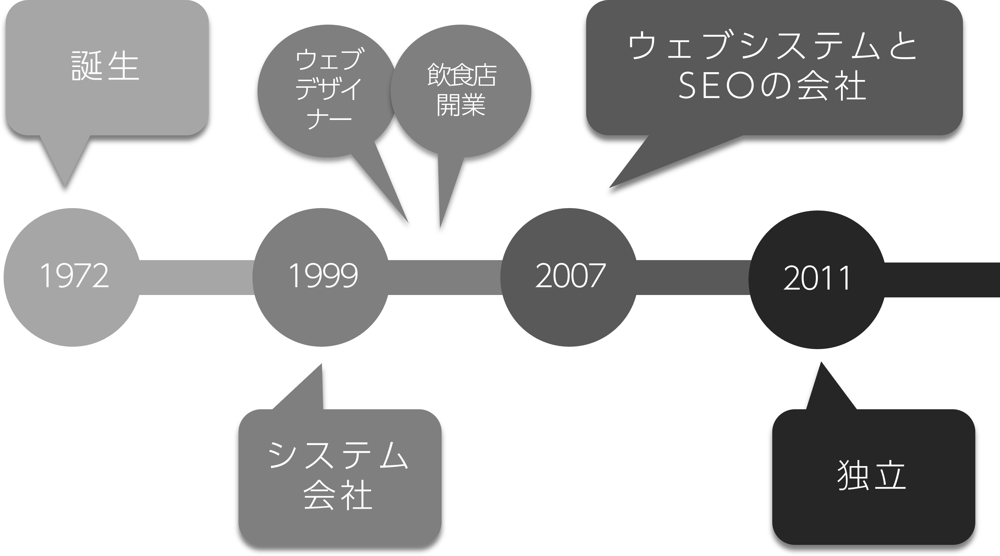
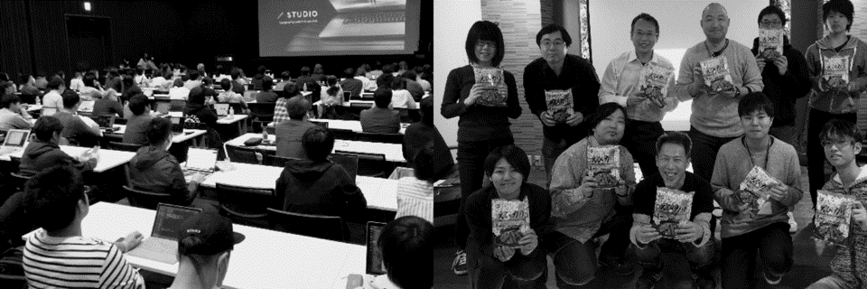
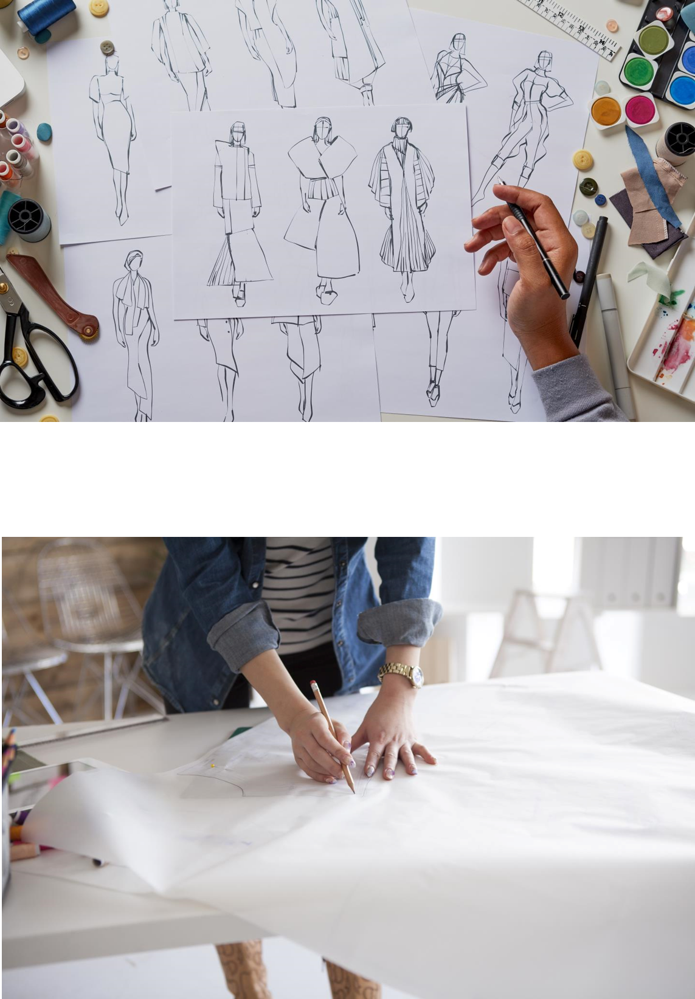
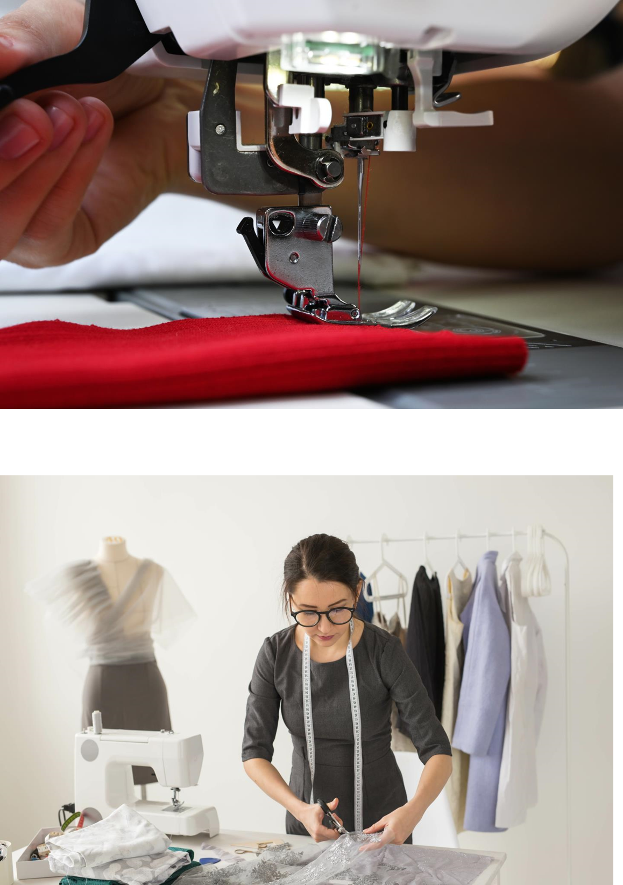

# コーディング  ライブ授業
##  1週目「環境構築」


---

1. 自己紹介
1. ANY課題について
1. コーディングって
1. 準備
1. Visual Studio Code
1. 本日のメインイベント
1. HTML
1. インブラウザデザイン
1. 実習
1. 来週に向けて

---

## 講師の自己紹介

--

### 小泉 誠 
- Webデザイナー・UI/UXデザイナー
- フロントエンドエンジニア
- 集客やIT化コンサルタント etc.

<div></div>

--

<div style="text-align:left">
「Studio FireColor」という屋号で、フリーランスとして活動中。ウェブ制作会社、システム会社、SEO系の会社などで10年 以上の経験をつみ独⽴。<br>
独⽴から11年⽬（2022年現在）
</div>

<div style="margin-top: 2.4rem; text-align:left">
Webデザイナーに始まりフロントエンド全般、SEO、 マーケティング、システム開発、集客や社内のIT化のコンサルティングなど。<br>
現在は「本⼈も職種がわからない…」といった感じで、 ゼネラリスト道を邁進中。
</div>

--

- 代理店経由で大手企業の仕事が5割
- 元請で中小企業中心に5割

--



--

### activities
IT分野での活動

--

  

- Web系の勉強会の主宰やスタッフ
- Web技術の講師
- 高校教員の情報技術研修
- 子供向けプログラミング教育ボランティア

---

## ANYについて

--

すすんでる？

---

## コーディングって？

--

<div class="separateBox">
    <div class="separateBox-txt"><em>デザイン</em><br>洋服で言うなら型紙、設計図</div>
    <div class="separateBox-img"></div>
</div>

--

<div class="separateBox">
    <div class="separateBox-txt"><em>コーディング</em><br>縫製して製品にする部分</div>
    <div class="separateBox-img"></div>
</div>

---

## 準備

--

### ファイルを用意しよう

--

```
root(任意の名称のフォルダ)
├ assets：HTML以外の様々なファイルを格納
│ ├ css：CSSを格納
│ ├ images：画像ファイルを格納
│ └ js：JavaScriptを格納
│
├ index.html
```

--

### GitHubアカウント

---

## Visual Studio Code

--

### Visual Studio Codeとは

--

- Microsoftが開発する、オープンソースのコードエディタ
- HTML、CSS、JavaScriptはもちろん、様々な言語に対応
- 実はそれ自体がJavaScriptなどのフロントエンドの技術できている

--

### インストール

--

は、終わっているはず

--

終わってなかったら、授業受けながらしてね。  
プラグインもね

--

では、ちょっと触ってみましょう

--

用意しておいたフォルダを、VSCodeにドラッグ＆ドロップ！

--

```HTML

<!DOCTYPE html>
<html lang="ja">
<head>
	<meta charset="UTF-8">
</head>
<body>
	
</body>
</html>

```

--

```HTML

<!DOCTYPE html>
<html lang="ja">
<head>
	<meta charset="UTF-8">
</head>
<body>
	Hello World
</body>
</html>

```

---

## 本日のメインイベント

--

### LiveServerプラグイン

--

開発にはWebサーバーがあると便利

--

開発に使うPCはWinやMac  
でも、WebサーバーってLinux系のOSが多い

--

レンタルサーバーなどにあげながらの開発は現実的ではない

--

パスの利用も変わってくる

--

- "./assets/images/demo.png"
- "https://www.sample.com/assets/images/demo.png"
- "/assets/images/demo.png"

--

とはいえ、いきなりサーバーを建てるのは厳しい

--

LiveServerプラグインがあれば大丈夫！  
しかも自動でリロードなんかもしてくれる

--

### LiveShareプラグイン

--

ひとつのファイルを同時に複数人で閲覧編集ができる

--

百聞は一見に如かず

--

### その他のプラグイン

--

****zenkaku****

[https://marketplace.visualstudio.com/items?itemName=mosapride.zenkaku](https://marketplace.visualstudio.com/items?itemName=mosapride.zenkaku)

****Auto Rename Tag****

[https://marketplace.visualstudio.com/items?itemName=formulahendry.auto-rename-tag](https://marketplace.visualstudio.com/items?itemName=formulahendry.auto-rename-tag)

****Image preview****

[https://marketplace.visualstudio.com/items?itemName=kisstkondoros.vscode-gutter-preview](https://marketplace.visualstudio.com/items?itemName=kisstkondoros.vscode-gutter-preview)

---

## HTML

--

### HTMLってなんだっけ？

--

Hyper Text Markup Language

--

- HyperText：すごいテキスト、テキストを超えたテキスト
- Markup ：文章の意味を明確にするために印をつける
- Language：言語

--

HTMLはセマンティックを心がける

--

より正確に意味を持たせること

--

セマンティックなHTMLはデザインやコミュニケーションにつながる

--

#### デザインの4原則

--

- 近接
- 整列
- 強調
- 反復

--

- 近接：グループ化、関連する情報をまとめる
- 整列：要素をそろえる
- 強調：要素に優先度をつけてる
- 反復：繰り返すことで統一感を持たせる

--

```HTML
<ul class="cards">
    <li class="card"><h2>キャベツ</h2><p>春が旬の野菜</p></li>
    <li class="card"><h2>白菜</h2><p>冬が旬の野菜</p></li>
    <li class="card"><h2>きゅうり</h2><p>夏が旬の野菜</p></li>
</ul>
<ul class="cards">
    <li class="card"><h2>鶏肉</h2><p>ニワトリの食肉</p></li>
    <li class="card"><h2>牛肉</h2><p>牛の食肉</p></li>
    <li class="card"><h2>豚肉</h2><p>豚の食肉</p></li>
</ul>
```

--

- 正確な意味をもたせることができると、画面デザインするうえでも考えやすくなる
- 内容を整理できるようになれば、自分の理解も深まり、人にも伝えやすい

---

## インブラウザデザイン

---

## 実習

--

<span style="font-size: 1.6em;">11:45 まで</span>

- 修正することになると思いますので、大枠でかまいません
- idやclassは無くてもいいです。適切なタグで要素を構成することを重視してください

---

## 来週に向けて

--

### 課題

--

#### HTMLを完成させる！

- 来週の授業後に修正することになると思いますので、大枠でかまいません
- idやclassは無くてもいいです。適切なタグで要素を構成することを重視してください

--

### 予告

HTMLとCSSについてお伝えします


