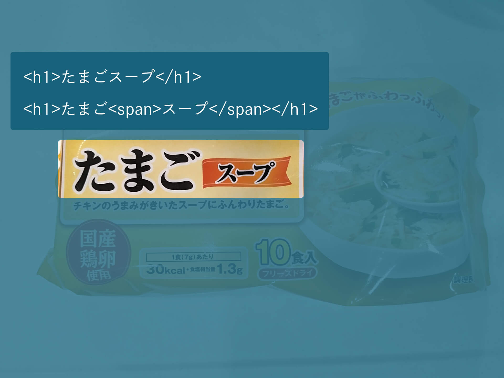
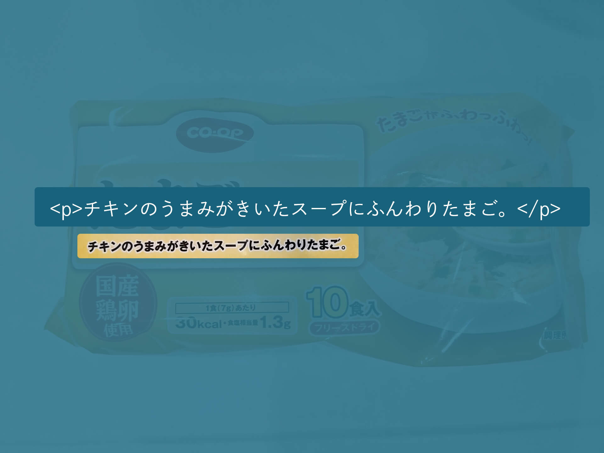
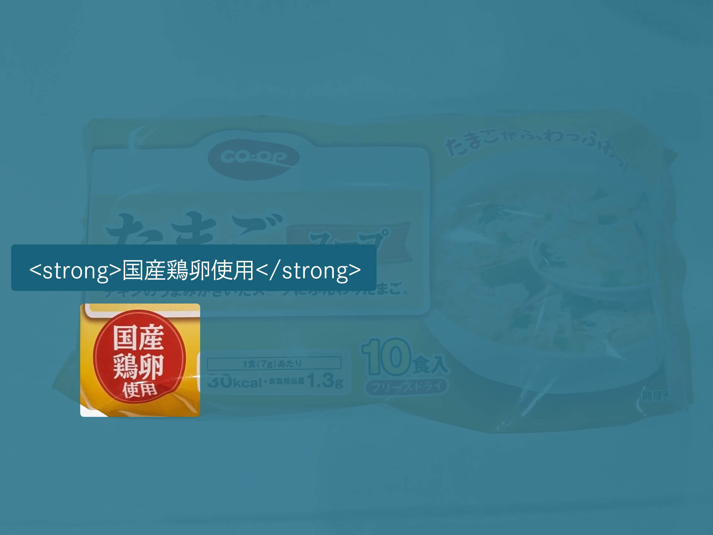
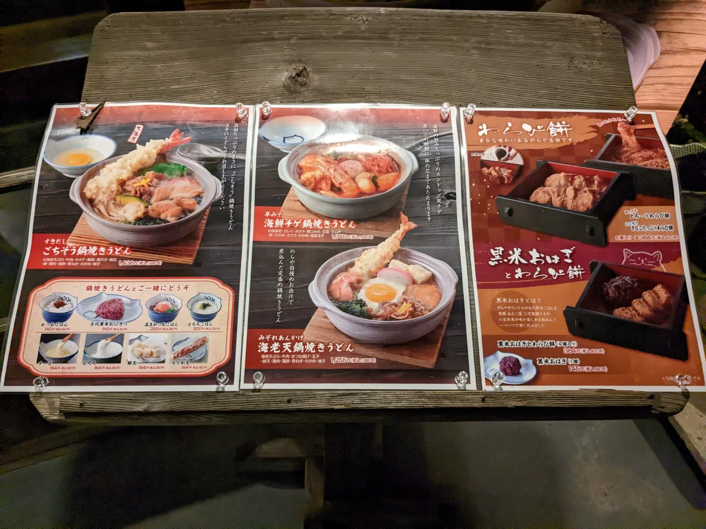
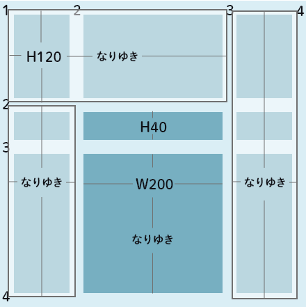

# コーディング  ライブ授業
##  2週目「HTMLとCSS」


---

1. 課題：HTML作成
1. アイスブレイク
1. CSS
1. このサイトだけは覚えておこう
1. ANYではでてない？便利なCSS

---

## 課題：HTML作成

--

できた？

--

### 一番悩んだところを教えて
デザインカンプとHTMLを照らし合わせながら

--

#### 構文チェック
W3C Markup Validation Service  
https://validator.w3.org/

---

## アイスブレイク

--

いろんなものをマークアップしてみよう

--


--



--



--



--


--

```html
<hgroup>
    <p>CO-OP</p>
    <h1>たまごスープ</h1>
    <p>チキンのうまみがきいたスープにふんわりたまご。</p>
</hgroup>
<strong>国産鶏卵使用</strong>
<section>
    <h2>1食<small>(7g)</small>あたり</h2>
    <ul>
        <li>30Kcal</li>
        <li>食塩相当量1.3g</li>
    </ul>
</section>
<p>10食入り<small>フリーズドライ</small></p>
```

--



---

## CSS

--

### CSS Gridを学ぶ

--

レイアウトを組むのによく使われるプロパティは？

--

- display: flex;
- float
- position
- display: grid;

--

- display: flex;　小さな単位
- float　文字の回り込む
- position　絶対的な位置指定
- display: grid;　大きな単位

--

#### CSS Gridを使ってみる

--


--



---

## このサイトだけは覚えておこう

--

### Can I use  
https://caniuse.com/

### MDN  
https://developer.mozilla.org/ja/docs/Web

---

## ANYではでてない？便利なCSS

--

### カスタムプロパティ

--

### 文字詰め

font-feature-settings

--

### :isと:where

--

どちらも複数のセレクタを選択するときに、便利

```
:is(.aaa, .bbb, .ccc) .xxx { ～ }
```
```
.aaa .xxx { ～ }
.bbb .xxx { ～ }
.ccc .xxx { ～ }
```

--

:isと:whereの違いは詳細度が上がるかどうか

--

:has

--

指定した要素をもつ要素を指定

--

子孫に.fooがあるdiv
```
div:has(.foo) { ～ }
```

--

```
<style>
    div { ～ }???
    div:has(.foo) { ～ }
</style>

<div></div>

<div>
    <div class="foo"></div>
</div>
```

--

### 要素をぼかす
backdrop-filter: blur  
<small>※backdrop-filterはぼかすだけじゃなくていろいろできる</small>
--

### 簡単に背景を固定
background-attachment: fixed

--

### CSSで画像のだし分け
image-set

--

### コンテンツ幅に合わせる
fit-content

--

### hoverが使えるデバイス

--

スマートフォンなどではHoverの概念がない

--

```
@media (hover: hover) and (pointer: fine) {
	a:hover {}
}
```

--

### 便利な計算や幅などの指定

--

calc

```
calc((1 + 2) * 10px)
```

--

- min・・・最大値を指定できる
- max・・・最小値を指定できる
- clamp・・・最大最小と推奨値を指定できる

minとmaxが逆っぽいけど・・・  
minなら、最大でここまでを決める  
ということはその値以上にはならない  
だから小さいぞということでmin

--

### 背景画像のブレンド

background-blend-mode

---

## 実習

--

<span style="font-size: 1.6em;">11:45 まで</span>

---

## 来週に向けて

--

### 課題

トップページを完成させよう  
<small>※JavaScriptが必要な部分以外</small>

--

### 予告

JavaScriptやるよ


